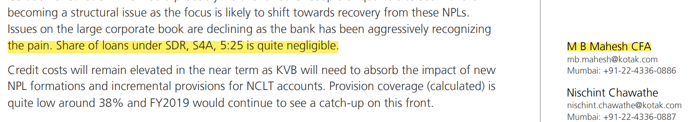

# Goal
To Extract necessary details from a given financial PDF document.
- Author Name
- Author Institution
- Companies
- Broker Recommendation
- Target Price of Company

# Approach
Our method has two major parts
1. PDF Document to Text
2. Extraction of details from the text

## PDF Document to Text
Although multiple software/libraries are available to convert a pdf document to text, most of the methods only extract from a plain background/single paragraph, they do not extract well from different backgrounds and positions of elements.

### PDFPlumber
After experimenting with multiple pdf->text packages in python, we decided to use pdfplumber [[1]](#1) as a baseline to extract the text from the pdf documents. The advantage of using this package is it's very fast and can be called in a single line of code. But the text extracted is not so accurate. 

So we can use pdfplumber if we want faster run time and if it's okay to compromise the accuracy a little.

### Tesseract
Tesseract [[2]](#2),[[3]](#3) is Google's OCR engine which can extract words from images in more than 100 languages and is trainable for new language/dataset. Its extensively used in mobile devices and Gmail spam detectors.

The latest version of tesseract [[4]](#4) uses an LSTM based Deep neural network engine for OCR and can handle different types of documents including bills, tabular images, memes, etc.

Tesseract usually takes a longer time than other libraries but has a better recognition performance. So tesseract can be used if runtime is not an issue.

With some experiments we found, using any library or even pytessseract model read the document line by line even if they are indifferent paragraphs, this can affect the text extraction process as the order of the words matter in Entity recognition.

### Tesseract with region split

Even the Tesseract engine reads the document line by line which can combine multiple paragraphs/segments of the document which can mislead the Entity Recognizer. So we have to split the documents into a different region of interest, so the order of the text is maintained.

We use simple computer-vision techniques to draw horizontal and vertical lines across the document which can well separate the regions by maintaining the order. Also, this was important to identify the authors(explained in the below section).

to

 then the tesseract model is used on each of these sub-document and the text of all the subdocument is combined, so that the order of tokens in each subdocument is maintained. After splitting sub documents, useless blank spaces are ignored.

 Advantage of this method,
 - The order of tokens in each subdocument is maintained
 
 Disadvantage
 - this approach has a lot of hyperparameters to tune
 - can be slow as each subdocument is recognized by the tesseract model.

## Text Extraction

The goal parameters to extract from these documents may not have any definite pattern, each document will report their stock target price differently, different page, different structure, ..., etc. Given the time and resources, this is also not a supervised or even a learnable task. 

We rely on some patterns that can normally be observed across the documents. Extracting these patterns using only logic and rules is not possible and can be expensive and time-consuming. And these observable patterns may not give good accuracy.

Although this is not a learnable task, we can use learned agents/models to aid in the identification of patterns/entities.

The first step to extract any information from a text is to understand the entities of the text. What does the text imply? what part of the text names some person/ company/ price of the stock? 

Question Answering systems [[5]](#5) can be used to find some answers, but for example, if we want to know the author of the document, nowhere in the article it says the author of the document is XXX and Q/A models are trained on specific sets of Documents and may not understand financial documents well.

Another approach will be to train Q/A systems with the type of financial documents we use, but his process can be expensive given the time and resources, it's not possible.

So we have to reply on the Langauge models trained on a different corpus which may or may not include financial corpus. But at least they can understand the language or some parts of the financial terms.

We used a Transformer [[6]](#6) model (RoBERTa [[7]](#7)) which is trained on Entity recognition task with a precision of 0.91. We can use the transformer model to point out what is the entity of each token and use some set of rules/patterns to identify the necessary details.

Advantage:
- BERT understands bidirectional tokens, it makes the decision be observing the tokens on both sides and thus tend to be more accurate than recurrent models.

Disadvantage:
- prediction of BERT models can be slower than other methods in packages like NLTK/Spacy. (But batching is possible, so if the server gets 1000 documents at a time, using GPU, predictions can be made in batches and can serve realtime)
- Implementation can be harder(fortunately spacy recently released v3, which contains a transformer model, but production level models will require low-level implementation)

## Extraction of details
- Author: Transformer model is used to identify the person in the text document and a token pattern matcher is used to identify potential names of authors with email ids, the common names from both the list are chosen as the author.
- Institution: Transformer model is used to identify the organizations in the document, the organization with maximum no of occurrence is chosen as every page of the document usually have the name of the institution and multiple parts of the doc like disclosure have a repetition of the institution name.
- Target Price: A token pattern matcher is used to extract the target price. The transformer model can also be used to identify the price/money entities from the document.
- Companies: Transformer is used to recognize the organizations and all the organizations except the author institutions which are in BSE listing(also option of no BSE filter) are considered.
- BUY/SELL Recommendation: not all the documents directly give a BUY/SELL call for a stock. Due to time constrain, it's not yet explored, but sentiment analysis can be employed to understand the recommendation. It may be as easy, as the document involves finance terms.

# Improvements and Future Work
- Firstly, extraction of text from pdf, some work needed to be done on the hyperparameters of the approach.
- Few financial documents have to be studied to get/understand the structure and how the required details are provided. Due to time constraints, only a few observable patterns have been experimented with.
- Many types of models can be experimented with packages like NLTY, Spacy, Hugging Face,..etc.
- Recently research works focus on extracting from the text, these papers can be helpful, although may require some time for implementation.
- Supervision can help, with the SOTA learned representations(like transformer language models), even a small amount of supervision can help the task. 
- A linguistic study is essential to understand further into the task and can help us set the token pattern matches. other types of matches can also be experimented with.
- Models trained on financial documents will surely help the task, we need a language model which can understand the financial terms. It can be expensive, but enterprises train their private models which may not be available publically.
- A combination of Linguistic knowledge and Deep Learning methods(with representations and unsupervised training) can sure help this task. 

# References
<a id="1">[1]</a> 
https://github.com/jsvine/pdfplumber

<a id="2">[2]</a> 
Ray Smith
Proc. Ninth Int. Conference on Document Analysis and Recognition (ICDAR), IEEE Computer Society (2007), pp. 629-633

<a id="3">[3]</a> 
https://github.com/tesseract-ocr/tesseract

<a id="4">[4]</a> 
https://tesseract-ocr.github.io/tessdoc/

<a id="5">[5]</a> 
Stroh, E., & Mathur, P. (2016). Question answering using deep learning.

<a id="6">[6]</a> 
Vaswani, A., Shazeer, N., Parmar, N., Uszkoreit, J., Jones, L., Gomez, A. N., ... & Polosukhin, I. (2017). Attention is all you need. arXiv preprint arXiv:1706.03762.

<a id="7">[7]</a> 
Liu, Y., Ott, M., Goyal, N., Du, J., Joshi, M., Chen, D., ... & Stoyanov, V. (2019). Roberta: A robustly optimized bert pretraining approach. arXiv preprint arXiv:1907.11692.